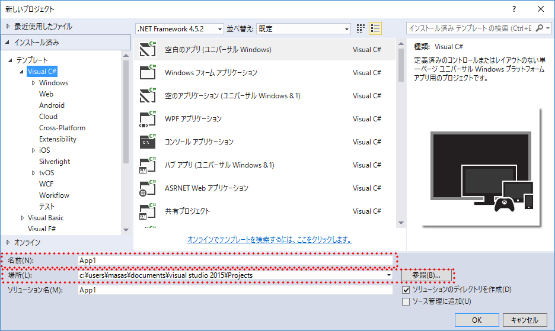
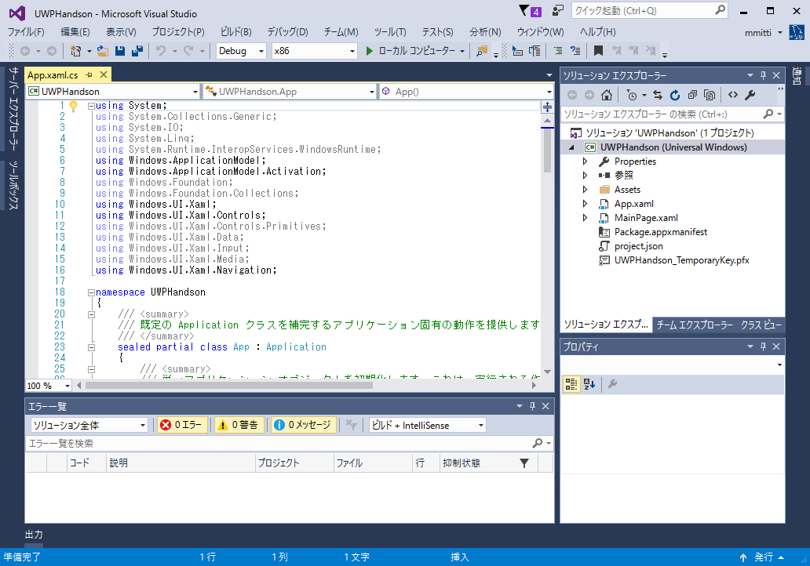
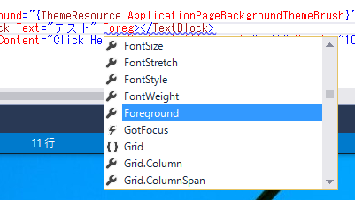
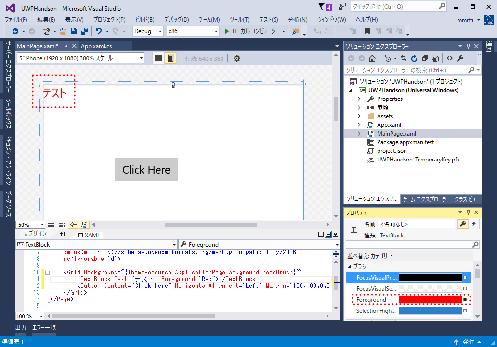
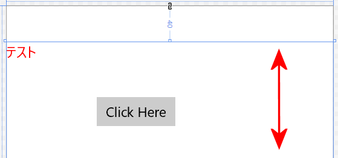

# Microsoftプログラミング技術全国ハンズオン UWP編 資料

## 1.注意事項
このハンズオンを行うには以下の環境が必要になります。  
* Windwos 10 搭載の PC
* Visual Studio Community 2015(もしくはそれ以上のエディション)
* ユニバーサル Windows アプリ開発ツール

準備ができていない方はお近くのスタッフに声をかけてください。

## 2.ファイル構成
UWP編のフォルダーには以下のものが含まれています。
* **README.md** : この資料
* **20170122HandsOnTokyo.sln** : 最終的な完成品のソリューションファイル
* **UWPHelloWorld/** : 課題 ボタン・テキストブロック・ダイアログのサンプル
* **UWPGithubReposOnLabel/** : 発展課題1 Githubのリポジトリー一覧を **テキストブロック** に表示するサンプル
* **UWPGithubReposOnList/** : 発展課題2 Githubのリポジトリー一覧を **リスト** に表示するサンプル

# 課題 ボタン・テキストブロック・ダイアログ
## 1.まずはプロジェクトを作ってみよう
インストールされたVisual Studioを起動します。  
起動したら以下の画面が立ち上がります。  
  

続けてメニューの「ファイル(F)」から「新規作成(N)」を選択し、「プロジェクト(P)」を選択します。

プロジェクトのテンプレートを選択するダイアログが表示されます。  
  

左側のテンプレートから「Visual C#」内の「Windows ユニバーサル」を選択し「空白のアプリ（ユニバーサル Windows)」を選択します。  

また、名前及び保存場所を選択します。

  

名前は任意ですが、ここではUWPHelloとします。

内容を確認し、問題なければ「OK」ボタンを押します。

  

Windows10のどのバージョン向けにプロジェクトを作成するか聞かれるのでデフォルトのまま「OK」を押します。

  

暫く待つとプロジェクトが作成され、コードが表示されると思います。

  

正しく生成できたか確認するため一旦実行します。

ツールバー上の実行ボタン「ローカルコンピュータ」をクリックし実行します。

  

実行ボタンの文字がローカルコンピュータ以外の場合は実行ボタン横「下三角マーク」を選択し「ローカルコンピュータ」を選択します。

ビルドが終わるのを待って白紙のUWPアプリが起動すれば問題ありません。

  

## 2.画面をデザインしよう
UWPの開発において、今回はC#とXAMLという2つの言語を使います。  
XAMLはマークアップ言語でユーザーインターフェースを定義するために用います。    
また、XAMLに対応するC#コードでイベントの処理やロジックを記載します。  

新規作成したプロジェクトには2つのXAMLが入っています。

  

今回は最初に表示される画面に対応するMainPage.xamlを編集します。  

(App.xamlはアプリ全体で利用されるリソースなどを定義するのに利用します。)  

「ソリューションエクスプローラー」から「MainPage.xaml」をダブルクリックして開きます。

  

するとXamlエディタが表示されます。

上部にグラフィカルビュー、下部にXAMLのコード（コードビュー）が表示されます。

また左側の「ツールボックス」には利用できるUIパーツ（ボタンや文字を表示するテキストブロック、文字を入力するテキストボックスなど）が表示されています。

 

### 2.1 ボタンを追加してみよう
UIの設計にはXAMLのコードを直接記述する方法とグラフィカルビューを利用する2つの方法があります。  
まずはグラフィカルビューを利用してボタンを追加します。

「ツールボックス」から「Button」をさがし「Button」をドラッグしてグラフィカルビューの白いページ部分にドロップします（左上がおすすめです）  

 

場所を変更したい場合はグラフィカルビュー上のボタンをドラッグすることで変更できます。

この状態で実行するとボタンが表示されます。

  

### 2.2 ボタンに表示されている文字を変えてみよう
追加したUIパーツはサイズや場所、背景の色や文字の大きさなど様々なパラメーターを設定できます。  
ここでは先程追加したボタンに表示されている文字列をグラフィカルビューを使って変更してみます。

まず、先程追加したグラフィカルビュー上のボタンをクリックして選択します。

次に「プロパティー」ウィンドウを開きます。(最初から表示されている場合もあります)

  

ボタンに関するパラメーターがたくさん表示されています。  

今回は表示されている文字を変えるので「共通」の中の「Content」を編集します。  

デフォルトでは「Button」になっていますので例えば「Click Here」にしてみます。  

  

変更後実行するとボタンの文字が変わっていると思います。  

  

>### メモ  
>主要なパラメーターとして背景色などの色は「ブラシ」、座標や余白などに関しては「レイアウト」、表示されている文字の大きさやフォントに関しては「テキスト」にパラメーターがあります。  
>パラメーターの数はたくさんあるため全部覚える必要はなく、必要なときに調べて使えればいいと思います。 

### 2.3 テキストブロックを追加しよう
今度は文字を表示するテキストブロックを追加します。  
先程のボタンと異なりXAMLのコードを直接編集して追加します。

コードビューのコードを見ると以下のようになっていると思います。

``` xaml
<Page
    x:Class="App1.MainPage"
    xmlns="http://schemas.microsoft.com/winfx/2006/xaml/presentation"
    xmlns:x="http://schemas.microsoft.com/winfx/2006/xaml"
    xmlns:local="using:App1"
    xmlns:d="http://schemas.microsoft.com/expression/blend/2008"
    xmlns:mc="http://schemas.openxmlformats.org/markup-compatibility/2006"
    mc:Ignorable="d">

    <Grid Background="{ThemeResource ApplicationPageBackgroundThemeBrush}">
        <Button Content="Click Here" HorizontalAlignment="Left" Margin="100,100,0,0" VerticalAlignment="Top"/>
    </Grid>
</Page>
```

重要なのは<Grid ...>から< /Grid>の間で、ここにUIのデザインをXAMLで記述します。

すでにグラフィカルビューで追加したボタンに関するXAMLが追加されています。  

この1行下にTextBlockを追加します。  
(TextBlockの位置がわかるようにテストと言う文字を表示します)
```xaml  
<Grid Background="{ThemeResource ApplicationPageBackgroundThemeBrush}">
    <Button Content="Click Here" HorizontalAlignment="Left" Margin="100,100,0,0" VerticalAlignment="Top"/>
    <TextBlock>テスト</TextBlock>
</Grid>
```

するとグラフィカルビューが更新されテキストブロックが追加されたのがわかると思います。

  

### 2.4 テキストブロックの文字色と場所を変えてみよう
ボタンの時と同様にグラフィカルビューで要素を選択してプロパティーから変更することも可能ですが、ここではXAMLを直接編集して変更してみます。

文字色の変更ですがForegroundプロパティーを指定することで変更できます。

赤色にするなら以下のようにTextBlockのXAMLを変更します。  

```xaml
<TextBlock Foreground="Red">テスト</TextBlock>
```

もし、Visual Studioで手で入力されている方はForegくらいまで入力すると自動補完が効いて選択肢が1つになると思うのでそのままEnterキーを押すことで入力できます。    
   
また、指定する色も指定できる色の一覧が候補として表示されると思います。  
  

色を指定すると即グラフィカルビューが更新されます。  
また、プロパティーウィンドウを開いていた方はそちらも更新されていることに気づくかと思います。。

  

場所の変更はMerginプロパティーを指定することで変更できます。

例えばページの左から20、上から10の位置に移動させたいときは

```xaml
<TextBlock Foreground="Red" Margin="20, 10, 0, 0">テスト</TextBlock>
```

のように編集します。

ここまで行うと以下のようになります。  
  
