# Microsoftプログラミング技術全国ハンズオン UWP編 資料

## 1.注意事項
このハンズオンを行うには以下の環境が必要になります。  
* Windwos 10 搭載の PC
* Visual Studio Community 2015(もしくはそれ以上のエディション)
* ユニバーサル Windows アプリ開発ツール

準備ができていない方はお近くのスタッフに声をかけてください。

## 2.ファイル構成
UWP編のフォルダーには以下のものが含まれています。
* **README.md** : この資料
* **20170122HandsOnTokyo.sln** : 最終的な完成品のソリューションファイル
* **UWPHelloWorld/** : 課題 ボタン・テキストブロック・ダイアログのサンプル
* **UWPGithubReposOnLabel/** : 発展課題1 Githubのリポジトリー一覧を **テキストブロック** に表示するサンプル
* **UWPGithubReposOnList/** : 発展課題2 Githubのリポジトリー一覧を **リスト** に表示するサンプル

# 課題 ボタン・テキストブロック・ダイアログ
## 1.まずはプロジェクトを作ってみよう
インストールされたVisual Studioを起動します。  
起動したら以下の画面が立ち上がります。  
  

続けてメニューの「ファイル(F)」から「新規作成(N)」を選択し、「プロジェクト(P)」を選択します。

プロジェクトのテンプレートを選択するダイアログが表示されます。  
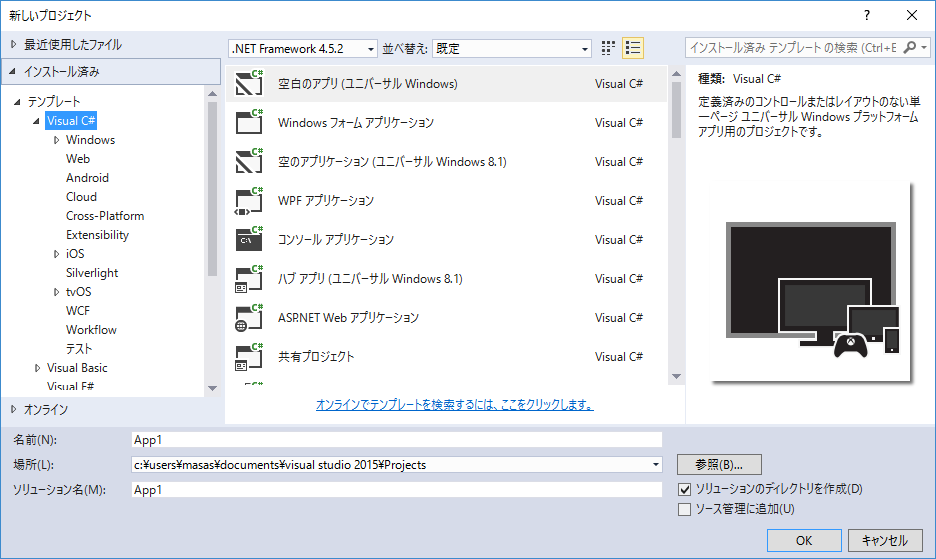  

左側のテンプレートから「Visual C#」を選択し「空白のアプリ（ユニバーサル Windows)」を選択します。  

また、名前及び保存場所を選択します。

  

名前は任意ですが、ここではUWPHandsonとします。

内容を確認し、問題なければ「OK」ボタンを押します。

  

Windows10のどのバージョン向けにプロジェクトを作成するか聞かれるのでデフォルトのまま「OK」を押します。

  

初めてUWPを開発される方はWindowsの設定が開く場合があります。

この場合は「開発者モード」を選択してください。

  

暫く待つとプロジェクトが作成され、コードが表示されると思います。

  

正しく生成できたか確認するため一旦実行します。

ツールバー上の実行ボタン「ローカルコンピュータ」をクリックし実行します。

  

実行ボタンの文字がローカルコンピュータ以外の場合は実行ボタン横「下三角マーク」を選択し「ローカルコンピュータ」を選択します。

ビルドが終わるのを待って白紙のUWPアプリが起動すれば問題ありません。

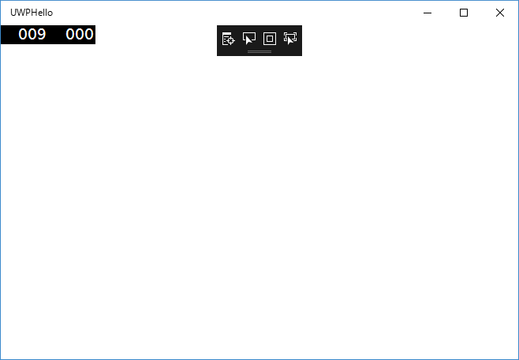  

## 2.画面をデザインしよう
UWPの開発において、今回はC#とXAMLという2つの言語を使います。  
XAMLはマークアップ言語でユーザーインターフェースを定義するために用います。    
また、XAMLに対応するC#コードでイベントの処理やロジックを記載します。  

新規作成したプロジェクトには2つのXAMLが入っています。

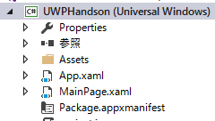  

今回は最初に表示される画面に対応するMainPage.xamlを編集します。  

(App.xamlはアプリ全体で利用されるリソースなどを定義するのに利用します。)  

「ソリューションエクスプローラー」から「MainPage.xaml」をダブルクリックして開きます。

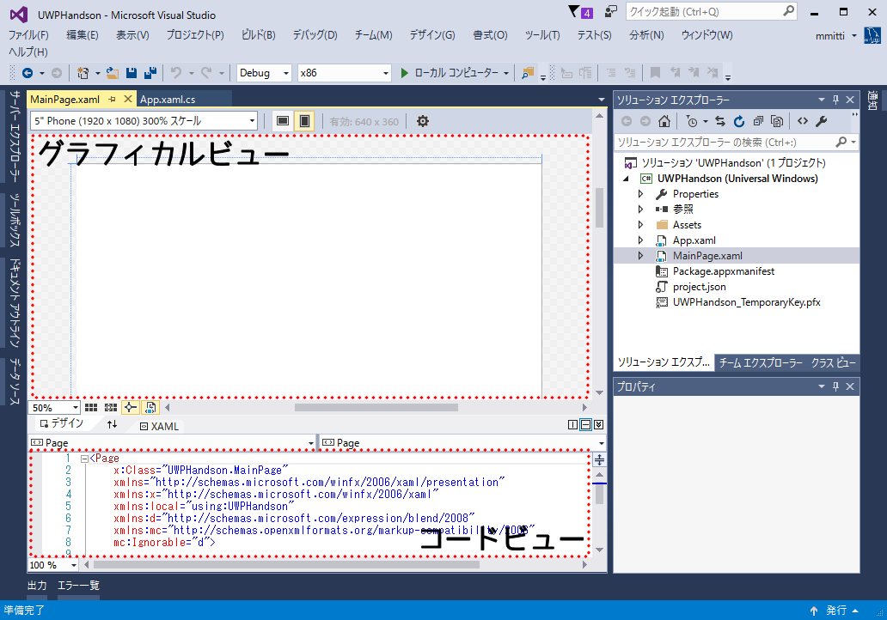  

するとXamlエディタが表示されます。

上部にグラフィカルビュー、下部にXAMLのコード（コードビュー）が表示されます。

また左側の「ツールボックス」には利用できるUIパーツ（ボタンや文字を表示するテキストブロック、文字を入力するテキストボックスなど）が表示されています。

 

### 2.1 ボタンを追加してみよう
UIの設計にはXAMLのコードを直接記述する方法とグラフィカルビューを利用する2つの方法があります。  
まずはグラフィカルビューを利用してボタンを追加します。

「ツールボックス」から「Button」をさがし「Button」をドラッグしてグラフィカルビューの白いページ部分にドロップします（左上がおすすめです）  

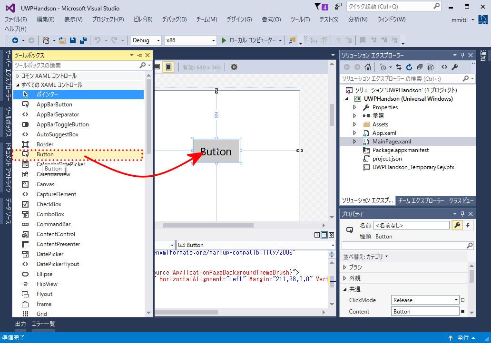 

場所を変更したい場合はグラフィカルビュー上のボタンをドラッグすることで変更できます。

この状態で実行するとボタンが表示されます。

  

### 2.2 ボタンに表示されている文字を変えてみよう
追加したUIパーツはサイズや場所、背景の色や文字の大きさなど様々なパラメーターを設定できます。  
ここでは先程追加したボタンに表示されている文字列を、グラフィカルビューを使って変更してみます。

まず、先程追加したグラフィカルビュー上のボタンをクリックして選択します。

次に「プロパティ」ウィンドウを開きます。(最初から表示されている場合もあります)

  

ボタンに関するパラメーターがたくさん表示されています。  

今回は表示されている文字を変えるので「共通」の中の「Content」を編集します。  

デフォルトでは「Button」になっていますので例えば「Click Here」にしてみます。  

  

変更後実行するとボタンの文字が変わっていると思います。  

  

>### メモ  
>主要なパラメーターとして背景色などの色は「ブラシ」、座標や余白などに関しては「レイアウト」、表示されている文字の大きさやフォントに関しては「テキスト」にパラメーターがあります。  
>パラメーターの数はたくさんあるため全部覚える必要はなく、必要なときに調べて使えればいいと思います。  
>
>ボタンの場所を変えるには「レイアウト」のMargin、VerticalAlignment、HorizontalAlignment、変更します。  
>Marginは上下左右からどれだけ隙間を空けるか、HorizontalAlignment(水平方向)とVerticalAlignment(垂直方向)はボタンを上や左に配置するか、中央に配置するか、左右広げて配置するかなどを制御します。  
>  
>例えばHorizontalAlignmentをLeft、 VerticalAlignmentをTop、Marginを左100 上100にすると図のようになります。  
>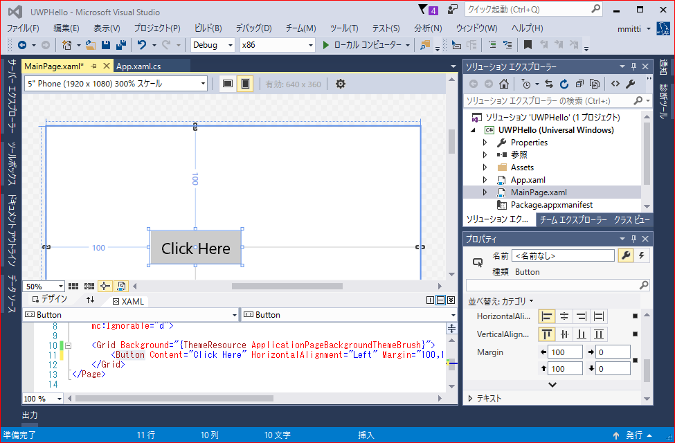  
>これはボタンを左上に配置し、左から100、上から100隙間を空けるという指定になります。
>
>VerticalAlignment,HorizontalAlignmentの設定とMarginの関係は以下の図のようになります。  
>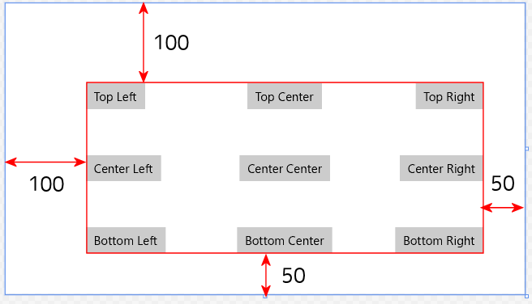   
>※すべてマージンを左・上が100　右・下が50で設定してあります。  
>※また、ボタンに表示されている文字はVerticalAlignment、HorizontalAlignmentの順で示しています。
>
>VerticalAlignmentやHorizontalAlignmentにStretchを指定すると図のように左右、もしくは上下方向にめいいっぱいに広がります。  
>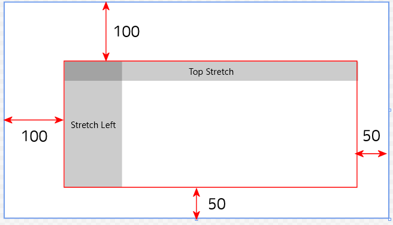  
>
>このようにMargin、HorizontalAlignment、VerticalAlignmentを変更することでどこにUIパーツの場所を制御できます。


### 2.3 テキストブロックを追加しよう
今度は文字を表示するテキストブロックを追加します。  
先程のボタンと異なりXAMLのコードを直接編集して追加します。

コードビューのコードを見ると以下のようになっていると思います。

``` xaml
<Page
    x:Class="App1.MainPage"
    xmlns="http://schemas.microsoft.com/winfx/2006/xaml/presentation"
    xmlns:x="http://schemas.microsoft.com/winfx/2006/xaml"
    xmlns:local="using:App1"
    xmlns:d="http://schemas.microsoft.com/expression/blend/2008"
    xmlns:mc="http://schemas.openxmlformats.org/markup-compatibility/2006"
    mc:Ignorable="d">

    <Grid Background="{ThemeResource ApplicationPageBackgroundThemeBrush}">
        <Button Content="Click Here" HorizontalAlignment="Left" Margin="100,100,0,0" VerticalAlignment="Top"/>
    </Grid>
</Page>
```

重要なのは<Grid ...>から< /Grid>の間で、ここにUIのデザインをXAMLで記述します。

すでにグラフィカルビューで追加したボタンに関するXAMLが追加されています。  

```xaml
<Button Content="Click Here" HorizontalAlignment="Left" Margin="100,100,0,0" VerticalAlignment="Top"/>
```

先頭のButtonはButtonというUIパーツを指し、他のContentoやHorizontal Alignmentなどはプロパティーを示します。  

この1行下にTextBlockを追加します。  
(TextBlockの位置がわかるようにテストと言う文字を表示します)
```xaml  
<Grid Background="{ThemeResource ApplicationPageBackgroundThemeBrush}">
    <TextBlock Text="テスト"></TextBlock>
    <Button Content="Click Here" HorizontalAlignment="Left" Margin="100,100,0,0" VerticalAlignment="Top"/>
</Grid>
```

するとグラフィカルビューが更新されテキストブロックが追加されたのがわかると思います。

  

### 2.4 テキストブロックの文字色と場所を変えてみよう
ボタンの時と同様にグラフィカルビューで要素を選択してプロパティから変更することも可能ですが、ここではXAMLを直接編集して変更してみます。

文字色の変更ですがForegroundプロパティを指定することで変更できます。

赤色にするなら以下のようにTextBlockのXAMLを変更します。  

```xaml
<TextBlock Text="テスト" Foreground="Red"></TextBlock>
```

もし、Visual Studioで手入力されている方はForegくらいまで入力すると自動補完が効いて選択肢が1つになると思うのでそのままEnterキーを押すことで入力できます。    
   
また、指定する色も指定できる色の一覧が候補として表示されると思います。  
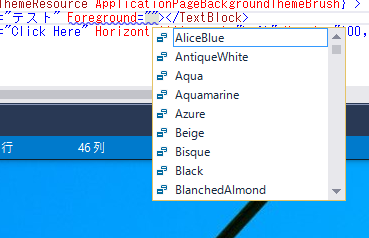  

色を指定すると即グラフィカルビューが更新されます。  
また、プロパティウィンドウの「ブラシ」を確認するとそちらも更新されていることに気づくかと思います。

  

場所の変更はMerginプロパティを指定することで変更できます。

例えばページの左から10、上から40の位置に移動させたいときは

```xaml
<TextBlock Text="テスト" Foreground="Red" Margin="0, 40, 0, 0"></TextBlock>
```
のように編集します。

また、このままだとテキストブロックが上40から一番下までを占めているので VerticalAlignmentをTopに指定します。
```xaml
<TextBlock Text="テスト" Foreground="Red" Margin="10, 40, 0, 0" VerticalAlignment="Top"></TextBlock>
```

変更前  
  
変更後  
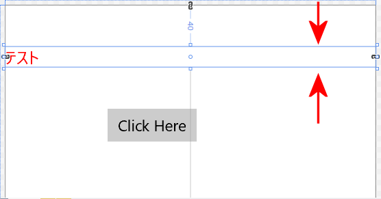  

ここまで行い実行すると以下のようになります。  
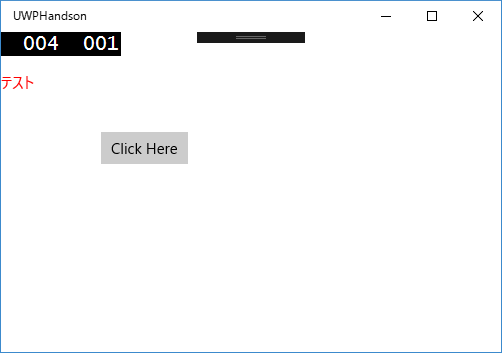  

>## メモ
>XAMLに記述する要素の順番には意味があります。  
>例えば先程のサンプルのTextBlockとButtonの順番を入れ替え、TextBlockの VerticalAlignmentをStretchにしてみます。
>```xaml
><Grid Background="{ThemeResource ApplicationPageBackgroundThemeBrush}">
>   <Button Content="Click Here" HorizontalAlignment="Left" Margin="100,100,0,0" VerticalAlignment="Top"/>
>   <TextBlock Text="テスト" Foreground="Red" Margin="20, 40, 0, 0" VerticalAlignment="Stretch"></TextBlock>
></Grid>
>```
>この状態で実行してボタンをクリックするとクリックできません。  
>これはボタンの手前にテキストブロックが表示されているためです。  
>基本的には下の要素ほど手前に来ますが、要素の前後関係を制御するにはZIndexプロパティを指定することで制御できます。


## 3.ボタンを押したときに処理をしよう
先程追加したボタンはそのままでは何も起きません。  
UIパーツはそれぞれが例えば押された、マウスが乗った、キーが押されたなどの**イベント**が起きたときに処理を追加してあげることで初めて動きます。  

今回はボタンを押されたときにメッセージボックスが表示され、テキストブロックの文字が変わると言うものを作ります。  

### 3.1 UIパーツに名前をつける
イベントの処理を行うためにC#のコードを書きますが、C#のコードでUIパーツを識別するためにXAMLで名前をつけます。

名前の指定はXAMLの各要素に x:Name="名前" を属性として追加します。  
先程追加したボタンにはButton、テキストブロックにはLabelという名前を追加します。  

```xaml  
<Grid Background="{ThemeResource ApplicationPageBackgroundThemeBrush}">
    <TextBlock x:Name="Label" Text="テスト" Foreground="Red" Margin="10, 40, 0, 0" VerticalAlignment="Top"></TextBlock>
    <Button x:Name="Button" Content="Click Here" HorizontalAlignment="Left" Margin="100,100,0,0" VerticalAlignment="Top"/>
</Grid>
```

### 3.2 イベントハンドラーの追加
ボタンが押された、マウスが乗ったなどのイベントが起きたときに行う処理（イベントハンドラー）を追加します。  
まず、現在編集しているMainPage.xamlに関連付けられたC#のコード MainPage.xaml.csを開きます。  

  
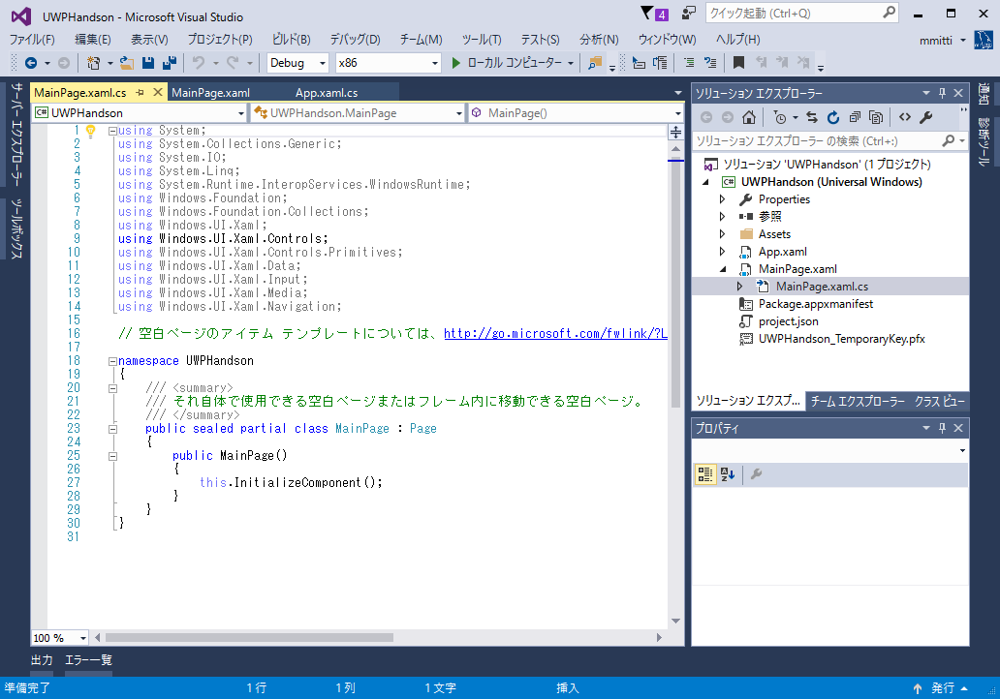

開くとthis.InitializeComponent();を呼び出しているだけのコンストラクターがあります。  
InitializeComponent()はXAMLから自動生成されたコードの中で定義されています。  

次にボタンを押されたときに処理するメソッドを作成します。  

戻り値や引数の型は決められたものにする必要がありますが、メソッド名は自由に決めても大丈夫です。  
ここではbutton_Clickとします。  

```cs
private async void button_Click(object sender, RoutedEventArgs e)
{
    /*あとで追加*/
}
```

続けてボタンが押されたというイベントと作成したメソッドを対応付けます。  

コンストラクターを以下のように変更します。  

```cs
public MainPage()
{
    this.InitializeComponent();
    this.Button.Click += button_Click;
}
```

これは先程**Button**と名付けたボタンの**クリックイベント**が起きたときに**button_Click**というメソッドを呼び出すように登録する...という処理になります。  

### 3.3 ダイアログを出してみる
このままではメソッドが呼び出されても何もしないので試しにダイアログを出してみます。  

UWPのダイアログはいくつか種類がありますが、ここでは簡単に使えるMessageDialogを使います。


```cs
private async void button_Click(object sender, RoutedEventArgs e)
{
    var dialog = new MessageDialog("Hello UWP world!", "hello world");
    await dialog.ShowAsync();
}
```

MessageDialogのインスタンスを作成しdialogという変数に格納します。  
その後MessageDialogのShowAsync()を呼び出すことでダイアログが表示されます。  
ShowAsyncは非同期なメソッドなのでawaitをつけてダイアログを閉じるまで待ちます。  

上記のコードを追加してもnew MessageDialog付近に赤下線がでてきます。

  

下線の上にマウスカーソルを持っていくとヒントボタンが出てくるのでusing Windows.UI.Popups;を選択します。  

  
  

これはC言語のincludeに相当するものです。  

この段階で実行しボタンを押してみると図のようにダイアログが表示されます。  


### 3.4 テキストブロックやボタンのプロパティを変更する
先程に引き続きボタンが押されたときにテキストブロックやボタンのプロパティを変更してみます。  
ボタンの文字列を変更するにはButtonのContentプロパティを変更します。  

```cs
private async void button_Click(object sender, RoutedEventArgs e)
{
    var dialog = new MessageDialog("Hello UWP world!", "hello world");
    await dialog.ShowAsync();
    this.Button.Content = "Hello UWP World";
}
```
お気づきかもしれませんが、XAMLで設定したプロパティの名前とコードで指定するプロパティ名は対応しています。

同様にテキストブロックのプロパティも変更してみます。  
いろいろなプロパティがありますが文字の大きさ(FontSize)とテキスト(Text)を変えてみます。  

```cs
private async void button_Click(object sender, RoutedEventArgs e)
{
    var dialog = new MessageDialog("Hello UWP world!", "hello world");
    await dialog.ShowAsync();
    this.Button.Content = "Hello UWP World";
    this.Label.FontSize = 30;
    this.Label.Text = "You're Completed first step!";
}
```

この状態で実行しボタンを押すと、ダイアログが表示され、ダイアログを閉じるとテキストブロックのサイズと文字、ボタンの文字が変化します。  

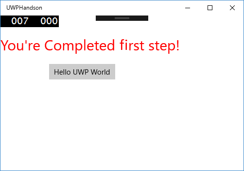

# お疲れ様でした
これにて午前の部 UWP編は終わりです。  

時間がある方、難易度が低いと感じた方は引き続き発展課題にも挑戦してみてください。
また、帰宅後に興味を持ったという方もぜひ発展課題に挑戦してみてください。  

なお、発展課題の内容は午後に行うXamarin編と同等の内容をUWPで行うものになります。  

# 発展課題1 Githubのリポジトリー一覧をテキストブロックに表示する
この課題では「ボタン」を押すと「テキストボックス」で指定したユーザーのリポジトリ一覧GithubのAPIを利用して取得し、「テキストブロック」に表示するものを作成します。  
発展課題1では主にリポジトリ一覧を取得する部分を作成します。  

参考 [GithubAPIのリファレンス](https://developer.github.com/v3/)

## 1.テキストボックスの追加
基本課題を引き続き編集していきます。  
今回は文字を入力するUIパーツのテキストボックス(TextBox)を追加します。  

ツールボックスからTextBoxを探し、グラフィカルビューのページにドラッグ・アンド・ドロップで追加するか、以下のようにXAMLを編集して追加します。  
```xaml
<Grid Background="{ThemeResource ApplicationPageBackgroundThemeBrush}">
    <!-- 省略 -->
    <TextBox></TextBox>
</Grid>
```

また、C#のコードの方で入力された文字を取得するので名前をつけます。  
ここではUserNameという名前をつけます。 

```xaml
<Grid Background="{ThemeResource ApplicationPageBackgroundThemeBrush}">
    <!-- 省略 -->
    <TextBox x:Name="UserName"></TextBox>
</Grid>
```

また、お好みで場所などのレイアウトを調整してください。    

サンプルでは以下のように配置を変更しました。  
```xaml  
<Grid Background="{ThemeResource ApplicationPageBackgroundThemeBrush}">
    <TextBlock x:Name="Label" Text="テスト" Foreground="Red" HorizontalAlignment="Center" VerticalAlignment="Top" Margin="0,100,0,0"></TextBlock>
    <TextBox x:Name="UserName" HorizontalAlignment="Stretch" VerticalAlignment="Bottom" Margin="30,0,30,60"/>
    <Button x:Name="Button" Content="Click Here" HorizontalAlignment="Stretch" VerticalAlignment="Bottom" Margin="30,0,30,20"/>
</Grid>
```

上記のXAMLの場合は以下のような配置になります。  
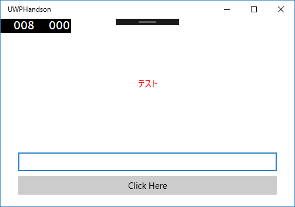

## 2. テキストボックスに入力された文字を取得する
続けてテキストボックスに入力された文字列を取得してみます。  
ここでは実際に取得できたことを確認するため、**ボタン**を押すと、**テキストボックス**に入力された文字が**テキストブロック**に表示される物を作ります。  

ボタンのクリックイベントが起きたときに呼び出される**button_Clickメソッド**を変更します。


```cs
private async void button_Click(object sender, RoutedEventArgs e)
{
    var name = this.UserName.Text;
    this.Label.Text = name;
}
```
テキストボックスに入力された文字はTextプロパティーに格納されているのでそれをname変数にいれ、テキストブロックのTextプロパティーにセットすることでテキストボックスに入力された文字列がテキストブロックに表示されます。  

この状態で実行しテキストボックスに文字を入れてボタンを押すと、図のようにテキストブロックに同じ文字が表示されていると思います。  
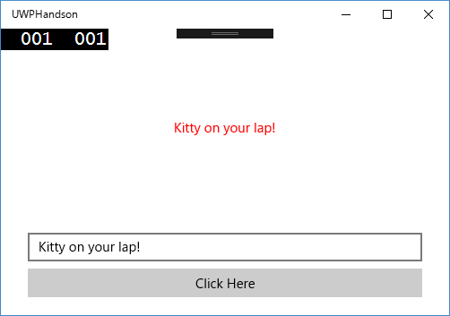

## 3. GithubのAPIを呼び出す
ここでは実際にGithubのAPIを呼び出し、指定したユーザーのリポジトリ一覧を取得します。  

今回利用するAPIのURLは  
https://api.github.com/users/ユーザー名/repos  
です。  
実際にブラウザでアクセス([https://api.github.com/users/mspjp/repos](https://api.github.com/users/mspjp/repos))してみると  
```json
[
  {
    "id": 50595877,
    "name": "20160208AzureHandsonNagoya",
    "full_name": "mspjp/20160208AzureHandsonNagoya",
    "owner": {
      "login": "mspjp",
      "id": 19600008,
以下略
```
のようにjson形式で応答が帰ってきます。 

参考 json [Wikipedia](https://ja.wikipedia.org/wiki/JavaScript_Object_Notation) 

今回はGithubのAPIサーバーを呼び出すのにHttpClientクラスを利用します。  
このクラスはブラウザのようにHTTPサーバーに接続し、データを受信できるクラスです。  

まずはMainPage.xaml.csにGithubのAPIを呼び出し、呼び出した結果を取得するメソッドを作成します。  

```cs
public async Task<string> GetGithubRepos(string userName) {
    /*これから実装*/
}
```
検索するユーザー名を引数としてもらい文字列string型で取得結果を返却する関数です。  
しかし、HttpClientでHTTPサーバーに接続し、応答を取得する処理は非同期処理なのでasyncキーワードを付け、Task<string>型を返す必要があります。  

このコードをコピペするとTaskとGetGithubReposに赤波線が出ますが、Taskの方はマウスカーソルを持っていき、ヒントボンタからusingを選択するかコード上部にusing System.Threading.Tasks;を追加してください。  
(GetGithubReposの赤波線はreturn指定内から出ているだけです。あとで実装するので放置です。)  

まず、URLを作成します。  
https://api.github.com/users/ユーザー名/repos のユーザー名を引数のuserNameにします。  
置換や文字列の結合など実装方法は複数ありますが、ここではstring.Formatを利用します。  

```cs
var url = string.Format("https://api.github.com/users/{0}/repos", userName);
```
string.Formatの第一引数のフォーマット文字列の中の{0}を第二引数に指定されたものに置換します。    
第行き引数に指定する書式については[こちら](https://msdn.microsoft.com/ja-jp/library/dwhawy9k(v=vs.110).aspx)を御覧ください。

続けてHttpClientクラスのインスタンスを作成し、HTTPリクエストのヘッダーにユーザーエージェントを指定します。  
明示的にユーザーエージェントを指定しなくてもHTTPサーバーに接続できる場合もありますが、GithubAPIガイドラインにユーザーエージェントを指定することが必須となっているため明示的に指定します。  

```cs
var httpClient = new HttpClient();
httpClient.DefaultRequestHeaders.Add("User-Agent", "Mozilla/5.0 (compatible; MSIE 10.0; Windows NT 6.2;WOW64; Trident / 6.0)");
```

最後にhttpClient.GetStringAsync(string URL)を非同期で呼び出すことで指定したURLにリクエストを送った結果を取得します。

```cs
return await httpClient.GetStringAsync(url);
```

ここまでをまとめるとGetGithubReposメソッドは以下のようになります。
```cs
public async Task<string> GetGithubRepos(string userName) {
    var url = string.Format("https://api.github.com/users/{0}/repos", userName);
    var httpClient = new HttpClient();
    httpClient.DefaultRequestHeaders.Add("User-Agent", "Mozilla/5.0 (compatible; MSIE 10.0; Windows NT 6.2;WOW64; Trident / 6.0)");
    return await httpClient.GetStringAsync(url);
}
```

このメソッドを先程修正したbutton_Clickメソッドの中で呼び出してやればテキストボックスに指定したユーザーのGithubのリポジトリ一覧を含むjsonがテキストブロックに表示されます。  

```cs
private async void button_Click(object sender, RoutedEventArgs e)
{
    var name = this.UserName.Text;
    var result = await GetGithubRepos(name);
    this.Label.Text = result;
}
```

このこまで実装した状態で、実行し、テキストボックスにGithubのユーザー名を入力してボタンを押すと以下のようになります。  
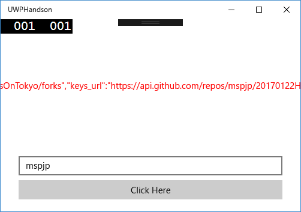

なお、ユーザーが見つからない場合は何も表示されなかったり以下のように例外が表示されます。  
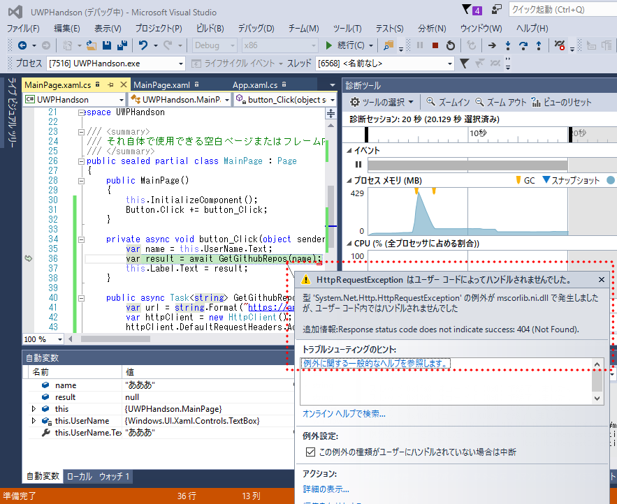  

例外処理についてはここでは扱わないものとしますが、実際のアプリケーションを開発する場合は例外処理をする必要があります。  

例外処理の方法については[こちら](http://dobon.net/vb/dotnet/beginner/exceptionhandling.html)を御覧ください。  

# 発展課題2
発展課題2では発展課題1で取得したGithubAPIの応答を加工し一覧表示（List）をします。

## 1. ライブラリの導入
取得したjsonをC#のオブジェクトに変換するため、Json.netというライブラリを導入します。  

Json.netを利用したjsonからC#のオブジェクトに変換する方法として複数の方法がありますが、ここでは自作クラスに変換する方法を用います。  

json.netについては[こちら](http://www.newtonsoft.com/json)を御覧ください。  

ライブラリの導入にはnugetというパッケージマネージャーを利用します。  

プロジェクトを右クリックし「NuGetパッケージの管理(N)」を選択します。  
  

次に「参照」を選択し検索ボックスに「Json.net」と入力します。  
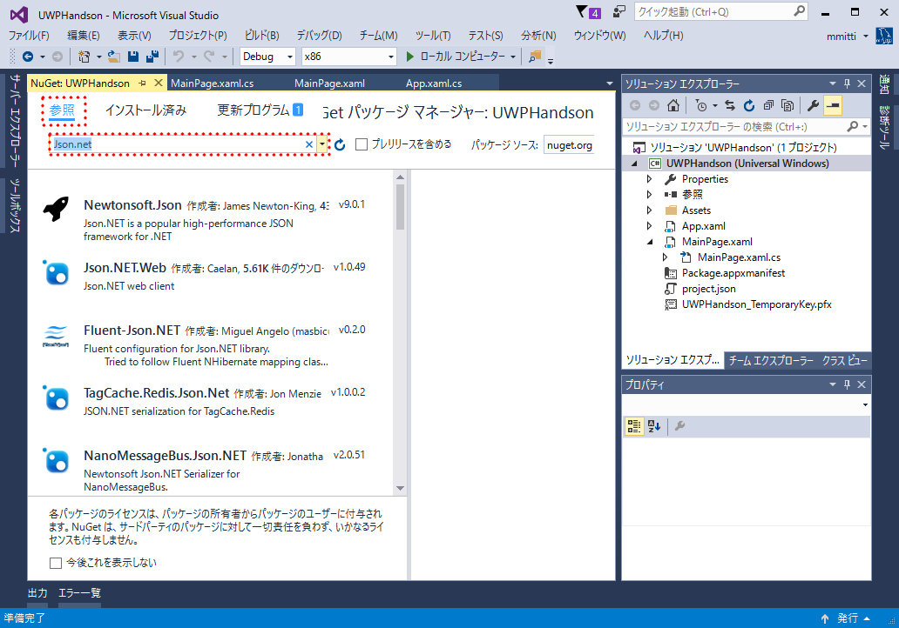  

「Newtonsoft.Json」を選択し「インストール」を選択します。  
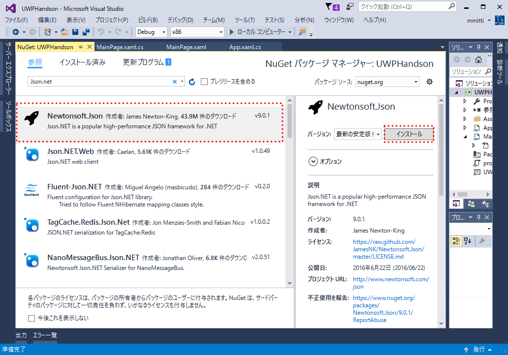  

インストールするプロジェクトの名前を確認して「OK」を選択します。  
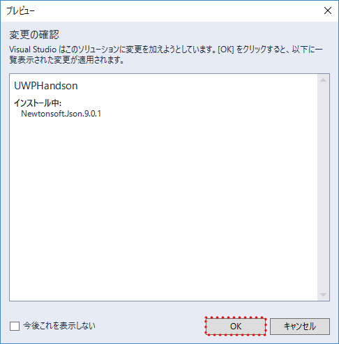  

出力に正常にインストールされましたと表示されれば完了です。  
  

## 2. 取得したjsonデータをC#のオブジェクトに変換

次に、json構造と同じ内容のC#のクラスを作成します。  
jsonの構造に合わせて同じ名前、型を決めて定義します。  

クラスの作成はプロジェクトを右クリックし「追加(D)」から「新しい項目(W)」を選択します。  
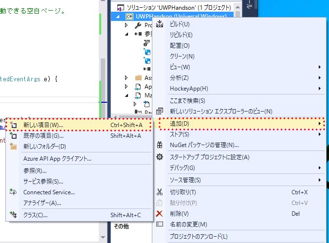  

「クラス」を選択し、クラス名を入力します。  
ここではGithubRepos.csとして作成しました。  
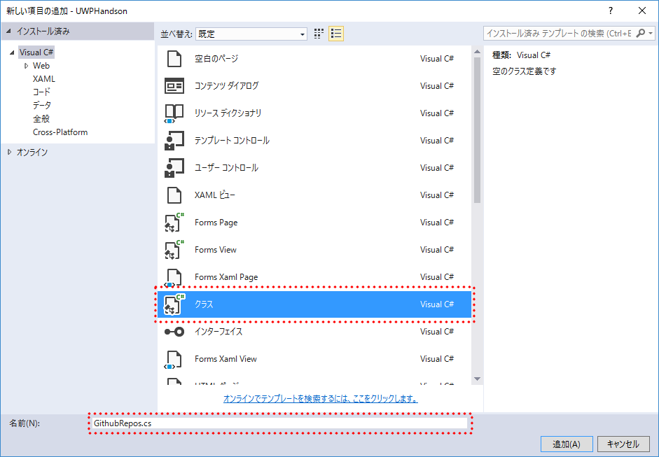  

内容は以下のようにします。  

```cs
using System;
using System.Collections.Generic;
using System.Linq;
using System.Text;
using System.Threading.Tasks;

namespace UWPHandson
{

    public class Owner
    {
        public string Login { get; set; }
        public int Id { get; set; }
        public string AvatarUrl { get; set; }
        public string GravatarId { get; set; }
        public string Url { get; set; }
        public string HtmlUrl { get; set; }
        public string FollowersUrl { get; set; }
        public string FollowingUrl { get; set; }
        public string GistsUrl { get; set; }
        public string StarredUrl { get; set; }
        public string SubscriptionsUrl { get; set; }
        public string OrganizationsUrl { get; set; }
        public string ReposUrl { get; set; }
        public string EventsUrl { get; set; }
        public string ReceivedEventsUrl { get; set; }
        public string Type { get; set; }
        public bool SiteAdmin { get; set; }
    }

    public class GithubRepo
    {
        public int Id { get; set; }
        public string Name { get; set; }
        public string FullName { get; set; }
        public Owner Owner { get; set; }
        public bool Private { get; set; }
        public string HtmlUrl { get; set; }
        public string Description { get; set; }
        public bool Fork { get; set; }
        public string Url { get; set; }
        public string ForksUrl { get; set; }
        public string KeysUrl { get; set; }
        public string CollaboratorsUrl { get; set; }
        public string TeamsUrl { get; set; }
        public string HooksUrl { get; set; }
        public string IssueEventsUrl { get; set; }
        public string EventsUrl { get; set; }
        public string AssigneesUrl { get; set; }
        public string BranchesUrl { get; set; }
        public string TagsUrl { get; set; }
        public string BlobsUrl { get; set; }
        public string GitTagsUrl { get; set; }
        public string GitRefsUrl { get; set; }
        public string TreesUrl { get; set; }
        public string StatusesUrl { get; set; }
        public string LanguagesUrl { get; set; }
        public string StargazersUrl { get; set; }
        public string ContributorsUrl { get; set; }
        public string SubscribersUrl { get; set; }
        public string SubscriptionUrl { get; set; }
        public string CommitsUrl { get; set; }
        public string GitCommitsUrl { get; set; }
        public string CommentsUrl { get; set; }
        public string IssueCommentUrl { get; set; }
        public string ContentsUrl { get; set; }
        public string CompareUrl { get; set; }
        public string MergesUrl { get; set; }
        public string ArchiveUrl { get; set; }
        public string DownloadsUrl { get; set; }
        public string IssuesUrl { get; set; }
        public string PullsUrl { get; set; }
        public string MilestonesUrl { get; set; }
        public string NotificationsUrl { get; set; }
        public string LabelsUrl { get; set; }
        public string ReleasesUrl { get; set; }
        public string DeploymentsUrl { get; set; }
        public string CreatedAt { get; set; }
        public string UpdatedAt { get; set; }
        public string PushedAt { get; set; }
        public string GitUrl { get; set; }
        public string SshUrl { get; set; }
        public string CloneUrl { get; set; }
        public string SvnUrl { get; set; }
        public string Homepage { get; set; }
        public int Size { get; set; }
        public int StargazersCount { get; set; }
        public int WatchersCount { get; set; }
        public string Language { get; set; }
        public bool HasIssues { get; set; }
        public bool HasDownloads { get; set; }
        public bool HasWiki { get; set; }
        public bool HasPages { get; set; }
        public int ForksCount { get; set; }
        public object MirrorUrl { get; set; }
        public int OpenIssuesCount { get; set; }
        public int Forks { get; set; }
        public int OpenIssues { get; set; }
        public int Watchers { get; set; }
        public string DefaultBranch { get; set; }
    }

}
```

続けてjsonオブジェクトからGithubRepoの配列に変換します。  
MainPage.xaml.csを開き、変換できるかどうかを確認するため、ボタンクリック時に呼び出されるbutton_Clickメソッド内でたしかめます。  

```cs
private async void button_Click(/*略*/) {
    /*略*/
    var sources = JsonConvert.DeserializeObject<List<GithubRepo>>(result);
}
```

最後に変換されたかどうかをデバッガーを利用し確認します。  

var sourcesの行にブレークポイントを配置し実行します。  
  

ブレークポイントにヒットしたあとはステップオーバーをクリックし、1行進めたところでsourcesにマウスカーソルを載せると変数の中身を見ることができます。  
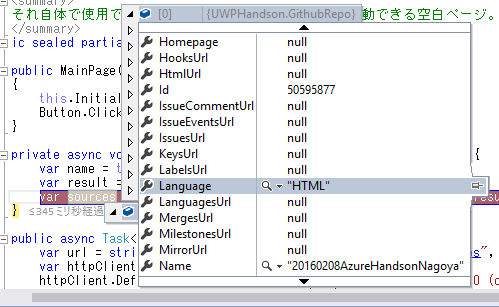

ブレークポイント配置、デバッグ方法、変数の見方などは[こちら](https://github.com/mspjp/201612hackathonyokohama/blob/master/csharp/DEBUG.md)を御覧ください。  

確認できたあとはbutton_Clickに追加した確認用のコードは削除してください。

## 2. リスト形式で表示
続けて、MainPage.xamlを開き、一覧表示を行うリスト(ListView)を追加します。 
また、TextBlockは削除してください。   

```xaml
<ListView x:Name="RepoList" HorizontalAlignment="Stretch" Margin="0,0,0,100" VerticalAlignment="Stretch"/>
```

ここではRepoListと名前をつけました。  

ListViewはItemsに要素を追加したり、Xaml上で子に要素を追加すると一列に並べて表示されます。  

続けてMainPage.csに戻り、Labelに関する行を削除し、jsonの文字列からGithubRepoクラスに変換し、RepoListに要素を追加するメソッドを追加します。  

```cs
public void SetListData(string data) {
    /* これから実装 */
}
```

まずは、引数として渡されたjson文字列からGithubRepoクラスの配列に変換します。  

```cs
public void SetListData(string data) {
    var sources = JsonConvert.DeserializeObject<List<GithubRepo>>(data);
}
```

つづけてGithubRepoの配列から1つずつ要素を取り出し、適当な情報をリストのItemsに追加します。  
ここではurlを表示することにします。  

```cs
public void SetListData(string data) {
    /*略*/
    foreach (var src in sources) {             
        this.RepoList.Items.Add(src.Url);
    }
}
```

最後に作成したメソッドをボタンが押され、GithubのAPIの応答が帰ってきたあとの部分で呼び出します。   

```cs
private async void button_Click(/*略*/)
{
    /*略*/
    SetListData(result);
}
```

これでボタンを押すとGithubのAPIを呼び出しjsonを取得、取得したjsonをGithubRepoクラスに変換し、リポジトリの情報（ここではUrl）を取り出しリストに表示する　までができました。  

この状態で実行すると図のようになります。  

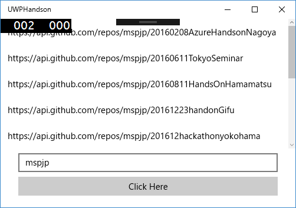